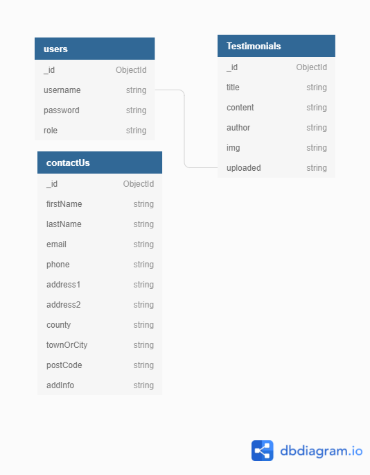

# Pride In Coding

# Deployed Site
...

## UX Design

### Strategy
Pride In Coding is a Summer Coding Camp for teen transgenders. 
To connect with like minded, to feel respected, to feel confident, to feel save and to start new friendships. 
And to learn coding. 
Every user has the option to register for an account and to login at their account.
On this website the admin has the option to use all the CRUD functions: Create, Read, Update and Delete.

### User Stories
Viewing and Navigation by visitor
- View a list of all the activities 
- Easily navigate through the pages
- ..

Registration and User Accounts by Site User
- Easily register for an account
- Receive an email confirmation after registering
- Easily login or logout
- Easily recover my password
- Have a personalized user profile

### Scope
This website consists of the following sections:

- Home / landing page
- Program / activities
- Testimonials
- About
- Contact

### Wireframes

 - [About Page](design-resources/wireframes/about-wireframe.jpg)
 - [Testimonials Page](design-resources/wireframes/testimonials-wireframe.png)
 - [Login/Register Page](design-resources/wireframes/login-register.png)
 - [Testimonial Submission Page](design-resources/wireframes/testimonial-submission.png)

### Stucture
- Header: ...
- Landing Page: ...
- Program Page: ...
- About Page: ...
- Contact Page: ...
- Login Page: ...
- Sign Up Page: ...
- Profile Page: ...

### Skeleton

### Surface
- Font Family text: ...
- Background color: ...
- Color schema: ...

### Database Design

## Media

Images: Pixabay + Pexels + Unsplash