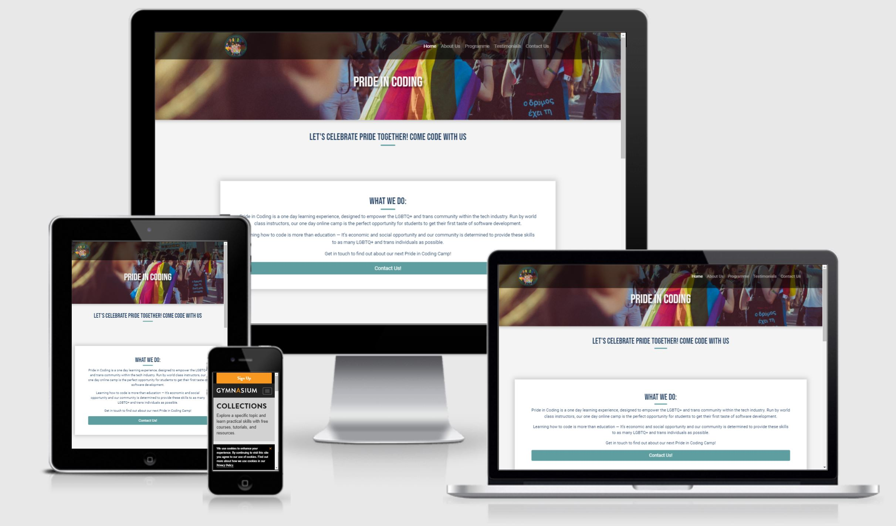
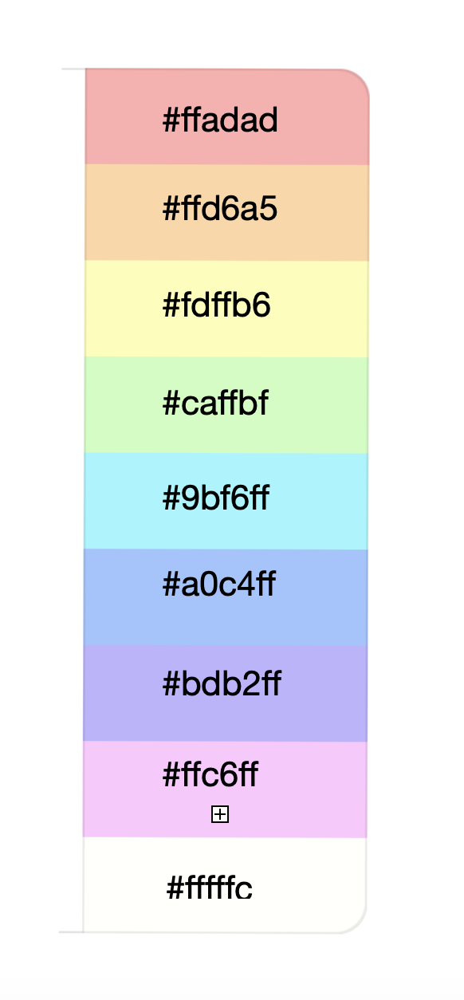

# Pride In Coding

## Deployed Site

[Live website](https://pride-in-coding.herokuapp.com/)

## UX Design

Pride In Coding is a online summer coding camp for teen transgenders.  
From starting coders till professional coders who want to learn new coding skills and to create a trans coding community. 
To connect with like minded, to feel respected, to feel save and to start new friendships.  
And to learn coding with HTML5, CSS3 and JavaScript. 
The coding leaders are all transgenders who work as professional coders.

### User Stories
Viewing by visitor:
- Know more about our Pride in Coding
- Easily navigate through the website
- View a list of the activities 
- View a list of the programme
- Easily navigate through the pages
- View all coding leaders
- Contact the coding camp by a form
- Find our social media links

## Design
This website consists of the following sections:

### Base
Menu:
- Right Pride in Coding logo, which links to the home page
- Navbar menu items: Home, Programme, About Us, Testimonials, Contact Us
- Navbar hamburger icon on medium and small devices
- Navbar color: transparent

Footer: 
- Background-color: transparent
- Social media icons all different color of the color palette, linked to the right external website in a new browser
- Copyright text: white

Body: 
- Font-family: 'Roboto', sans-serif
- Font Family h1-h6: 'Bebas Neue', sans-serif
- Font color: #213f61 / dark blue
- Background color: #f4f4f4 / light grey
- Color Schema:

### Home 
[Wireframe Home Page](design-resources/wireframes/Homepage-wireframe.png)

### Programme

### About
[Wireframe About Page](design-resources/wireframes/about-wireframe.JPG)
- Flip card: width 300px, height 300px
- Flip card back color: #caffbf

### Testimonials
[Wireframe Testimonials Page](design-resources/wireframes/testimonials-wireframe.png)

### Contact
[Wireframe Contact Page](design-resources/wireframes/contact-wireframe.JPG)

## Database Design

## Technologies

### Languages
- HTML5
- CSS3
- JavaScript
- Python

### Frameworks, Libraries & Programs
- Flask
- MongoDB
- Bootstrap
- Balsamiq
- Gitpod
- GitHub
- Google Fonts
- Font Awesome
- Google Chrome Developer Tools
- Iamresponsivedesign

### Validators
- HTML validator
- CSS validator
- JS validator

### Media
- Pixabay
- Pexels 
- Unsplash